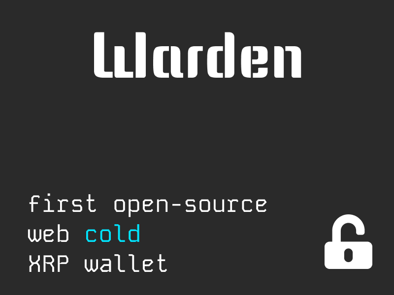
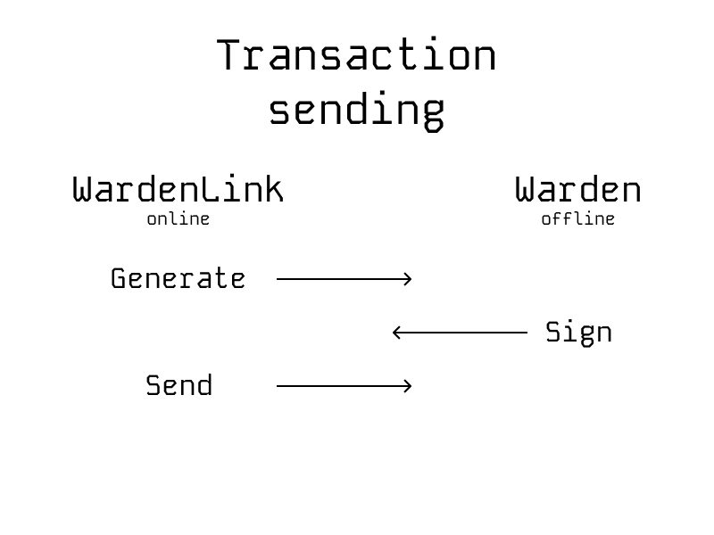

# Warden wallet

## About
First open-source software cold **non-hardware** wallet.  
Warden-Link allows you to generate and send signed transactions.  
Warden can sign transactions using your private key.

## Usage

- Transactions are filled out in **WardenLink**
- Transactions are signed with a private key using Warden, eliminating
  private key / mnemonics online interaction.
- After signing the transaction is sent via WardenLink.

- Wallet based on **XRPL** network

